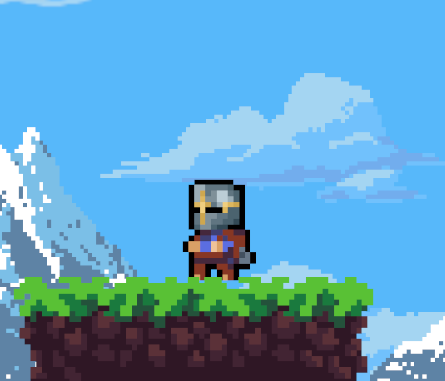
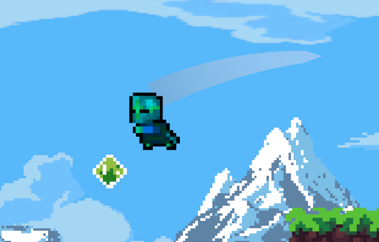

# 🎮 Progetto Informatica - Unity 2D Platformer

Gioco 2D sviluppato come progetto per il corso di Informatica. 

## 🖼️ Screenshot






## 🎯 Obbiettivo

Creare un gioco simile al famoso indie "**Celeste**"

Per ora sono riuscito a creare i comandi di gioco, i menu, la meccanica del salto, del dash, le spine, i suoni, l'aggrappo ai muri
e del recupero del dash tramite oggetto. Ho anche implementato dei metodi per far scivolare lentamente 
il personaggio se sta aggrappato troppo a lungo.

Il dash può essere usato solo una volta mentre il personaggio è in aria, per far capire quando lo hai già usato lo sprite del 
personaggio diventa azzurro. Il dash può essere resettatto in aria tramite la gemma verde che ha un countdown per la 
riattivazione ogni volta che viene usato.

Per ora ho finito solo un piccolo tutorial sulle implementazioni fatte.

Le animazioni del personaggio le ho fatte modificando degli asset di spunto per i movimenti più impegnativi.
Le tilemap sono tutte degli asset trovati su itch.io.


## 🚧 TO DO LIST

* checkpoint
* livelli diversificati
* sfondo più animato
* animazione morte da caduta
* (**Forse**) impostazioni più complete
* (**Forse**) collezionabili
* (**Forse**) selettore di livelli


## 🛠️ Installazione

1. Clona il repository:
   ```bash
   git clone https://github.com/RobertoAgnetti/Progetto-Informatica.git
   
2. Apri il progetto con Unity (versione 2022.3.62f1 LTS)
   
3. premi Play per avviare il gioco

## 🎮 Comandi

* Freccia Destra/Sinistra o a/d : Muovi il personaggio.

* Spazio: Salta.

* Mouse sinistro: Attaccati al muro.

* Shift: Esegui dash.

## 📚 Risorse

* Video su youtube 

* Chat GPT (Usato solo per imparare)

## 👤 Autore

Nome: Roberto Agnetti
